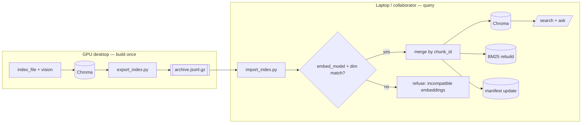

# Design Document

## Overview

This feature lets one machine build a Smart Archive index and hand it to another as a single portable file. A GPU desktop can do the expensive embedding and vision extraction once; laptops and collaborators import the result and query without ever re-embedding. It also supports enrichment — importing a vision-enabled bundle into a text-only archive to fill in chart/figure/table chunks — and merging archives across people.

The format is a **gzip JSONL bundle**: a self-describing `Header` line followed by one `Chunk_Record` per line, each carrying a chunk's id, text, embedding vector, and metadata. Import is **merge-by-chunk-id**: idempotent and additive. The receiving machine rebuilds its BM25 keyword index from the imported text, so the bundle carries no engine-specific index — only portable data.

Two correctness ideas anchor the design:

1. **Content-based Chunk_Id (portability).** The current id hashes the source's *relative path* and a *global chunk position*, which breaks dedup across machines with different layouts and is fragile when vision adds sections. This feature redefines the id to hash only stable content — **file name + text hash + location + content_type + an intra-source disambiguator** — so identical chunks get identical ids anywhere, and a document's text chunks keep their ids whether or not vision ran. This is a deliberate, one-time id-scheme change requiring a reindex of pre-existing archives to dedup against new bundles.

2. **Embedding-model gate (safety).** A query vector must come from the same embedding model and dimension that built the stored vectors. The header records `embed_model` + `embed_dim`; import hard-refuses a mismatch, because there is no safe way to mix embedding spaces in one collection.

Everything is CLI-driven (`export_index.py`, `import_index.py`), respects the existing ingest lock (no export/import while an index job runs), and treats bundle content as untrusted input — validated, size-bounded, never executed.

## Architecture



### Where the pieces live

- `backend/app/bundles/format.py` — the bundle schema: `Header`, `ChunkRecord`, a writer, and a streaming reader/validator. Shared by export and import; contains no Chroma/Ollama coupling.
- `backend/app/bundles/export.py` — reads chunks from the vector store (all / by source / by group) and writes a bundle.
- `backend/app/bundles/import_.py` — validates a bundle, applies the embedding-model gate, merges by chunk id, rebuilds BM25, updates the manifest.
- `backend/export_index.py`, `backend/import_index.py` — thin CLI entry points (argparse) that call the above and print reports.
- `backend/app/ingestion/chunker.py` — the `_chunk_id` change (content-based id).

### Consistency after import

Import touches the same three stores the indexer keeps in sync: Chroma (vectors + text + metadata), the BM25 index (rebuilt from all chunk text after a merge that added anything), and the manifest (mark imported sources present). This mirrors `indexer._rebuild_keyword_index()` and `manifest.record()` so an imported archive is immediately queryable and internally consistent.

## Components and Interfaces

### 1. Content-based Chunk_Id (`chunker.py`)

Replace the path+index hash with a content-only hash:

```python
def _chunk_id(source_file: str, location: str, content_type: str,
              text: str, occurrence: int) -> str:
    h = hashlib.sha1()
    for part in (source_file, location, content_type, str(occurrence)):
        h.update(part.encode("utf-8")); h.update(b"\x00")
    h.update(text.encode("utf-8"))
    return h.hexdigest()
```

- **`source_file`** = the file *name* only (`Path.name`), not the relative directory — so the same document dedups across layouts (Req 10.1).
- **`text`** = the chunk's own text hashed in — the strongest identity signal; different content ⇒ different id (Req 10.3).
- **`location` + `content_type`** distinguish a page's text chunk from a table/figure chunk at the same page.
- **`occurrence`** = an intra-source counter that increments only among chunks sharing the same (file, location, content_type, text) key, disambiguating genuine duplicates within one document (Req 9.5). Critically it is **not** the global chunk index, so text-chunk ids are unaffected by vision sections appended later (Req 9.2, 9.3).

`chunk_sections` computes `occurrence` with a small dict keyed by `(location, content_type, text)` as it emits chunks, instead of using the loop's global `idx`. The stored `chunk_index`/`total_chunks` metadata can remain for display/ordering; they simply stop feeding the id.

**Migration:** because ids change, existing archives must be force-reindexed to produce new-scheme ids before their chunks will dedup against new bundles (Req 10.4). This is documented, not automated.

### 2. Bundle format (`bundles/format.py`)

**On disk:** UTF-8 JSONL, gzip by default (`.jsonl.gz`), plain `.jsonl` optional. Line 1 is the header; every subsequent line is a chunk record.

```python
BUNDLE_FORMAT_VERSION = 1

@dataclass
class BundleHeader:
    format_version: int
    embed_model: str
    embed_dim: int
    vision_included: bool          # any chunk with content_type in {chart,figure,ocr}
    chunk_count: int
    sources: dict[str, int]        # source_path -> chunk count (summary)
    created_at: float
    checksum: str                  # sha256 over the concatenated chunk-record lines
```

```json
{"_bundle": { ...BundleHeader... }}
{"id": "...", "text": "...", "embedding": [768 floats], "metadata": {...}}
```

- **Writer** streams: it can't know `chunk_count`/`checksum` until all records are written, so it writes records to a temp file while updating a running sha256 and counter, then prepends the finalized header and gzips to the destination (atomic `os.replace`).
- **Reader** is a generator: yields the validated header first, then validated records one at a time (streaming, so a large bundle never loads fully into memory). Each record is size-capped before JSON parsing (Req 8.7).

### 3. Export (`bundles/export.py`)

```python
def export_bundle(out_path: Path, *, sources: list[str] | None = None,
                  group_id: str | None = None, gzip_output: bool = True) -> dict:
```

- Resolves the chunk set: a group_id resolves to member source_paths (via the group store); an explicit `sources` list filters by `source_path`; neither ⇒ all (Req 2).
- Pulls chunks from Chroma including `documents`, `metadatas`, and **`embeddings`** (Chroma's `get(include=["embeddings","documents","metadatas"])`).
- `embed_dim` is taken from the length of the first embedding; `embed_model` from `settings.embed_model`; `vision_included` computed from the content types present.
- Zero matches ⇒ report and exit without writing a silent empty bundle (Req 2.4).
- Returns/report: chunk count, source summary, output path (Req 1.6).

### 4. Import (`bundles/import_.py`)

```python
def import_bundle(in_path: Path, *, replace_sources: bool = False,
                  max_record_bytes: int = ...) -> dict:
```

Sequence:
1. **Lock check** — refuse if an index job is running (Req 11.1).
2. **Read + validate header** — bad/absent header or unsupported version ⇒ refuse, add nothing (Req 8.1, 8.2).
3. **Embedding gate** — header `embed_model`/`embed_dim` must equal the installation's; else refuse and report both sides (Req 6).
4. **Replace-source (optional)** — if requested, delete existing chunks for each source present in the bundle *before* adding (Req 7), scoped to those sources only.
5. **Stream records** — for each record: validate JSON + required fields + embedding length == `embed_dim` (Req 8.3, 8.4); skip+count invalid ones. Buffer valid records and upsert to Chroma in batches; **skip ids already present** in the store (merge-by-id, Req 4.1, 4.2). Track added vs skipped-existing.
6. **Checksum** — compare computed sha256 to header; warn on mismatch (Req 8.6). (Warn, not refuse: a truncated bundle may still have imported useful complete records.)
7. **Rebuild BM25** if anything was added (Req 4.5, 12.2).
8. **Manifest** — mark each imported source present (Req 12.3). Since imported chunks may not correspond to a local raw file, the manifest entry records the source as import-originated (size/mtime may be absent; a sentinel signature marks it imported so a later local reindex still behaves).
9. **Report** — added, skipped-existing, invalid-skipped, sources touched (Req 4.4, 8.3).

**Existing-id lookup:** fetch the set of ids already in Chroma once (`collection.get(include=[])` returns ids) and dedup against it in memory; new ids added during this import are also tracked so duplicates within the bundle are handled.

### 5. Vector store additions (`indexing/vector_store.py`)

- `get_all_ids() -> set[str]` — ids currently in the collection, for merge dedup.
- `add_precomputed(ids, texts, metadatas, embeddings)` — upsert chunks whose embeddings already exist (import path; no Ollama call), batched like `add_chunks`.
- `iter_export(source_paths: set[str] | None)` — yield `(id, text, metadata, embedding)` for export, filtered by source_path when given.
- Existing `delete_by_source` is reused for replace-source.

### 6. Group resolution for export

Export by group reuses the existing group store (`get_group_store().get(group_id).members`) to resolve member source paths. No new group logic.

### 7. CLI (`export_index.py`, `import_index.py`)

```
python export_index.py OUT [--sources A B ...] [--group GROUP_ID] [--no-gzip]
python import_index.py IN  [--replace-sources]
```

Both live at `backend/` (run with the venv), print a human-readable report, and exit non-zero on refusal (incompatible embeddings, malformed bundle, or indexing in progress). They call `job_manager.is_indexing()` for the lock (Req 11).

### 8. Config (`config.py`)

```python
bundle_max_record_bytes: int = 16 * 1024 * 1024   # per-record cap (Req 8.7)
bundle_default_gzip: bool = True                   # Req 1.4
```

`embed_model` already exists; the embedding dimension is discovered at runtime (first vector) rather than configured, avoiding a hardcoded 768.

## Data Models

### Chunk_Id (new derivation)

`sha1(source_file ∥ location ∥ content_type ∥ occurrence ∥ text)` — see §1. Content-only; path- and vision-independent.

### Bundle header (JSON, line 1)

```json
{"_bundle": {"format_version": 1, "embed_model": "nomic-embed-text",
             "embed_dim": 768, "vision_included": true, "chunk_count": 1509,
             "sources": {"calculus.pdf": 1200, "savitch.pdf": 309},
             "created_at": 1730000000.0, "checksum": "sha256:..."}}
```

### Chunk record (JSON, one per line)

```json
{"id": "ab12...", "text": "A bar chart of revenue...",
 "embedding": [0.01, -0.02, ...],
 "metadata": {"source_file": "report.pdf", "source_path": "reports/report.pdf",
              "file_type": "pdf", "location": "p. 3 (figure 1)",
              "content_type": "chart", "chunk_index": 42, "total_chunks": 1509,
              "token_count": 118}}
```

`source_path` is preserved from the bundle for citation display (Req 10.2); the id does not depend on it.

### Import report

```
{"added": int, "skipped_existing": int, "invalid_skipped": int,
 "sources": {source_path: added_count}, "checksum_ok": bool, "replaced": [source_path...]}
```

## Correctness Properties

*A property is a machine-checkable statement of intended behavior across all valid executions.*

### Property 1: Content-based id is path-independent
*For any* chunk content, computing the Chunk_Id with the same (file name, text, location, content_type, occurrence) yields the same id regardless of the source's directory path.
**Validates: Requirements 9.1, 10.1**

### Property 2: Text-chunk ids are vision-invariant
*For any* source, the set of Chunk_Ids for its text chunks is identical whether the source is indexed text-only or with vision enabled (vision only adds new ids).
**Validates: Requirements 9.2, 9.3**

### Property 3: Distinct chunks keep distinct ids
*For any* source, two chunks that differ in text, location, or content_type receive different Chunk_Ids; genuine duplicates within a source are disambiguated by occurrence.
**Validates: Requirements 9.5, 10.3**

### Property 4: Export/import round-trip preserves chunks
*For any* archive, exporting then importing into an empty archive on the same embedding model reproduces the same chunk set — ids, text, embeddings, and metadata — that was exported.
**Validates: Requirements 1.1, 1.2, 4.1, 12.1**

### Property 5: Import is idempotent
*For any* bundle, importing it twice adds zero chunks the second time and leaves the archive unchanged after the first import.
**Validates: Requirements 4.2, 4.3**

### Property 6: Merge is a union by id
*For any* local archive L and bundle B, after import the archive's chunk-id set equals L ∪ (ids in B), and no id is duplicated.
**Validates: Requirements 4.1, 4.2, 5.3**

### Property 7: Text-only + vision enrichment yields the union
*For any* source present locally as text-only, importing a vision bundle for that source results in the local text chunks plus the bundle's vision chunks, with text chunks not duplicated.
**Validates: Requirements 5.1, 5.2, 5.3**

### Property 8: Embedding mismatch is refused with no writes
*For any* bundle whose header embed_model or embed_dim differs from the installation's, import adds zero chunks and reports both sides.
**Validates: Requirements 6.1, 6.2, 6.3**

### Property 9: Selective export includes exactly the selection
*For any* source/group selection, the exported bundle contains chunks whose source_path is in the selection and no others; the header source summary matches.
**Validates: Requirements 2.1, 2.2, 2.3, 2.5**

### Property 10: Malformed input is contained
*For any* byte content, a bad header refuses the whole import (no writes); a bad or wrong-dimension record is skipped and counted while valid records still import; no bundle content is executed.
**Validates: Requirements 8.1, 8.2, 8.3, 8.4, 8.5**

### Property 11: Replace-source is scoped
*For any* replace-source import, existing chunks are removed only for sources present in the bundle; chunks of other sources are untouched.
**Validates: Requirements 7.1, 7.3**

### Property 12: Header self-description is accurate
*For any* exported bundle, the header's chunk_count equals the number of records, embed_dim equals each embedding's length, and vision_included is true iff a chart/figure/ocr chunk is present.
**Validates: Requirements 3.1, 3.2, 3.3, 3.4**

### Property 13: Lock blocks export/import while indexing
*For any* running index job, export and import refuse to run and report indexing in progress; when no job runs, they proceed.
**Validates: Requirements 11.1, 11.2, 11.3**

### Property 14: Archive stays consistent after import
*For any* import that adds chunks, the added chunks are retrievable by both semantic and keyword search, and the manifest lists their sources.
**Validates: Requirements 12.1, 12.2, 12.3, 12.4**

## Error Handling

| Condition | Where | Handling |
| --- | --- | --- |
| Index job running | export/import CLI | Refuse, exit non-zero, report indexing in progress (Req 11) |
| Missing/invalid header | import reader | Refuse whole import, no writes (Req 8.1) |
| Unsupported format_version | import | Refuse, report supported version (Req 8.2) |
| embed_model/dim mismatch | import gate | Refuse, report both sides, no writes (Req 6) |
| Invalid/oversized record | import reader | Skip + count, continue; size cap before parse (Req 8.3, 8.4, 8.7) |
| Embedding length ≠ header dim | import | Skip record, count invalid (Req 8.4) |
| Checksum mismatch | import end | Warn (possible truncation); keep validly-imported records (Req 8.6) |
| Empty selection | export | Report zero matched, write nothing (Req 2.4) |
| Chroma get without embeddings | export | Explicitly request embeddings; error clearly if unavailable |

Design choices:
- **Mismatch refuses, corruption warns.** An embedding-space mismatch is unrecoverable, so it hard-refuses. A checksum mismatch may still have delivered many complete, valid records, so it warns and keeps them.
- **Untrusted by default.** Records are size-capped pre-parse, validated field-by-field, and only ever treated as data. No `eval`, no pickle, no code paths driven by bundle content.

## Testing Strategy

Backend tests use pytest + Hypothesis (installed). Ollama/embeddings are faked; bundles are built in memory / `tmp_path`.

- **Property-based (≥100 examples), tagged `Feature: portable-index-bundles, Property N`:**
  - P1-P3 id derivation: path-independence, vision-invariance of text ids, distinctness/disambiguation — pure functions over generated chunk fields.
  - P4-P7 round-trip / idempotence / union / enrichment: build a fake store of chunks (with fake fixed-dim embeddings), export to a `tmp_path` bundle, import into a fresh fake store, assert id-set relationships. Enrichment: seed local text-only ids, import a bundle adding vision ids, assert union.
  - P8 embedding gate: generated header model/dim vs installation; refuse iff mismatch, zero writes.
  - P9 selective export: generated selections; exported source set ⊆ selection and complete.
  - P10 malformed input: generated garbage bytes / bad records; header errors refuse wholesale, record errors skip-and-count, valid neighbors still import.
  - P12 header accuracy: exported header fields match the record stream.
- **Example/integration:**
  - Real gzip round-trip through `format.py` writer+reader.
  - P11 replace-source scoping with a fake store.
  - P13 lock: monkeypatch `job_manager.is_indexing` → export/import refuse.
  - P14 consistency: after import into a fake store + real BM25 rebuild over imported text, a keyword query returns an imported chunk; manifest shows the source.
- **Isolation:** no real Ollama/Chroma/data; fakes and tmp paths throughout. A real cross-machine transfer is a manual verification step (documented), like prior model-dependent smokes.
