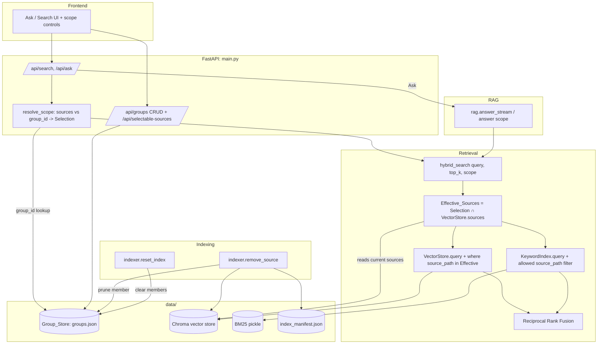

# Design Document

## Overview

This feature lets a query run against a chosen subset of indexed sources instead of the whole archive, and lets that subset be saved as a reusable, named **Group**. It is additive: the existing single retrieval path (`hybrid_search` → RRF over Chroma vector search + in-process BM25) stays the sole retrieval entry point, and the new scoping logic is threaded through that same path so Ask and Search behave identically with respect to scope.

The design introduces one new persistence component — a **Group_Store** — that mirrors the existing `Manifest`: a singleton backed by a JSON file under `data/`, written atomically (tmp-write-then-`replace`) and loaded corrupt-tolerantly. Everything else is a focused change to code that already exists: request/response schemas on `/api/search` and `/api/ask`, a new `/api/groups` CRUD surface and a selectable-sources endpoint, a `where` filter on the Chroma query, a post-filter on the BM25 results, and membership-pruning hooks in `remove_source` and `reset_index`.

Two ideas anchor the whole design and resolve every ambiguous case in the requirements:

- **Selection resolution and precedence.** A request may carry an ad-hoc `sources` list, a `group_id`, both, or neither. Resolution is deterministic: an ad-hoc `sources` list always wins (Req 10.4); otherwise a `group_id` is resolved to its current members (Req 10.1); otherwise there is *no selection* and the query runs whole-archive (Req 1.3, 1.4). The critical distinction: **no selection means whole archive**, but **an empty selection that was explicitly requested — an empty group, or a selection whose members are all unindexed — means zero results, not whole archive** (Req 11).
- **Effective_Sources.** A resolved selection is not used raw. It is intersected with the `source_path` values actually present in the Vector_Store at query time to form the **Effective_Sources** (Req 10.2). Stale members (removed or never-indexed sources) are silently dropped (Req 12.1) rather than breaking the query. Retrieval is then restricted to Effective_Sources in *both* retrievers before fusion (Req 1.5, 2.x).

The distinction between "no selection" (a `None` sentinel) and "an empty selection" (an empty set) is represented explicitly in the resolved scope object so the retrieval layer can tell "search everything" apart from "search nothing."

## Architecture

### Scope resolution and retrieval flow

A request enters at the API layer. The API resolves the request into a **QueryScope** — the single value that tells the retrieval layer what to search. The retrieval layer (`hybrid_search`) applies that scope to both retrievers before RRF. Nothing downstream of `hybrid_search` needs to know about groups or selections; `rag.py` simply forwards the scope it was given.



### Where scope is applied (and where it is not)

- **Resolution happens once, at the API boundary.** `main.py` turns the request into a `QueryScope` before calling into retrieval. This keeps group lookup and precedence rules out of the retrieval hot path and makes the not-found and validation errors HTTP-shaped (Req 10.3, 1.8).
- **Effective_Sources is computed inside `hybrid_search`.** The intersection with live Vector_Store contents must be done at query time, so it belongs next to retrieval rather than at the API layer. It is computed once and passed to both retrievers.
- **Both retrievers are filtered before fusion.** Chroma is filtered server-side with a `where={"source_path": {"$in": [...]}}` clause. BM25 has no metadata engine, so it is filtered in-process against the allowed set. RRF then fuses only already-filtered lists (Req 2.3).

### Consistency with the existing architecture

The Group_Store is a deliberate copy of the `Manifest` shape: a module-level singleton created lazily via `get_group_store()`, a `threading.Lock` around mutations, `_load()`/`_save()` with atomic replace, and corrupt-tolerant load. This is single-user local software; there is no need for a database, and JSON-under-`data/` matches every other piece of persisted state. Group membership pruning hooks into the two existing indexer functions (`remove_source`, `reset_index`) so groups can never silently point at content that no longer exists.

## Components and Interfaces

### 1. QueryScope (new value object)

A small immutable object that captures the resolved scope for one query. It lives in a new module `backend/app/search/scope.py` (retrieval-adjacent, importable by both `main.py` and `hybrid.py` without a cycle).

```python
@dataclass(frozen=True)
class QueryScope:
    # None  -> no selection: search the whole archive.
    # set() -> explicit empty selection: search nothing (zero results).
    # {...} -> restrict to these source_path values.
    selection: frozenset[str] | None

    @classmethod
    def whole_archive(cls) -> "QueryScope":
        return cls(selection=None)

    @classmethod
    def of(cls, sources: Iterable[str]) -> "QueryScope":
        # Deduplicates by construction (Req 1.7).
        return cls(selection=frozenset(sources))

    @property
    def is_unscoped(self) -> bool:
        return self.selection is None
```

The `None` vs empty-`frozenset` distinction is the mechanism that keeps "no selection ⇒ whole archive" separate from "empty selection ⇒ zero results" (Req 11). Deduplication is free because `selection` is a set (Req 1.7).

### 2. Scope resolution (in `main.py`)

A helper `resolve_scope(sources: list[str] | None, group_id: str | None) -> QueryScope` applied by both `/api/search` and `/api/ask` before retrieval:

```
if sources is not None and len(sources) > 0:   # ad-hoc wins (Req 10.4)
    validate size <= MAX_SELECTION (Req 1.8)
    return QueryScope.of(sources)
if group_id is not None:
    group = group_store.get(group_id)           # 404 if missing (Req 10.3)
    return QueryScope.of(group.members)          # empty group -> empty set (Req 11.1)
if sources is not None and len(sources) == 0:    # explicit empty ad-hoc list
    return QueryScope.of([])                      # zero results (Req 11.2) — see note
return QueryScope.whole_archive()                # nothing supplied (Req 1.3, 1.4)
```

**Design decision — omitted vs empty selection.** Req 1.4 says an *empty* Selection searches the whole archive, while Req 11.2 says a Selection whose Effective_Sources is empty returns zero results. These reconcile cleanly: an empty ad-hoc `sources` list at the API is treated as "no selection ⇒ whole archive" (Req 1.4), matching Frontend Req 15.4 which sends *no* selection when nothing is picked. "Zero results from an empty scope" (Req 11) arises specifically from a resolved **group** with no members, or from a non-empty selection whose members are all absent from the Vector_Store (empty Effective_Sources). So the API maps `sources == []` and `sources is None` and `group_id is None` all to `whole_archive()`; the zero-results path is reached only via an empty/all-stale group or an all-stale ad-hoc selection. This keeps the frontend contract simple (send nothing to mean everything) while honoring the group semantics.

### 3. hybrid_search (modified — `backend/app/search/hybrid.py`)

New optional `scope` parameter, defaulting to whole-archive so existing callers are unaffected:

```python
def hybrid_search(
    query: str, top_k: int | None = None, scope: QueryScope | None = None
) -> list[dict]:
    scope = scope or QueryScope.whole_archive()
    store = get_store()

    if scope.is_unscoped:
        semantic = store.query(query, settings.semantic_top_k)
        keyword = get_keyword_index().query(query, settings.keyword_top_k)
    else:
        effective = scope.selection & frozenset(
            store.sources().keys()
        )  # Effective_Sources
        if not effective:
            return []  # Req 11.1, 11.2, 10.5
        allowed = set(effective)
        semantic = store.query(query, settings.semantic_top_k, where_sources=allowed)
        keyword = get_keyword_index().query(
            query, settings.keyword_top_k, allowed_sources=allowed
        )
    # ... existing RRF fusion unchanged ...
```

Effective_Sources is `selection ∩ store.sources().keys()` (Req 10.2, 12.1). An empty intersection short-circuits to `[]` before touching either retriever (Req 10.5, 11). The RRF block is untouched — it fuses whatever lists it is handed (Req 2.3).

### 4. VectorStore.query (modified — `backend/app/indexing/vector_store.py`)

Add an optional `where_sources` set; when present, pass a Chroma metadata filter:

```python
def query(
    self, query_text: str, top_k: int, where_sources: set[str] | None = None
) -> list[dict]:
    if self.count() == 0:
        return []
    query_vec = ollama_client.embed_query(query_text)
    where = {"source_path": {"$in": sorted(where_sources)}} if where_sources else None
    res = self._collection.query(
        query_embeddings=[query_vec],
        n_results=min(top_k, self.count()),
        where=where,
        include=["documents", "metadatas", "distances"],
    )
    # ... unchanged result assembly ...
```

Chroma applies the `$in` filter server-side (Req 2.1), so out-of-scope chunks never enter the ranked list. Passing `where=None` preserves current behavior exactly.

### 5. KeywordIndex.query (modified — `backend/app/indexing/keyword_index.py`)

BM25Plus scores the whole corpus and has no metadata engine, so filtering is done in-process on the ranked candidates. To avoid losing in-scope hits when a small `top_k` is dominated by out-of-scope docs, the filter is applied to the ranked index list *before* truncating to `top_k`:

```python
def query(
    self, query_text: str, top_k: int, allowed_sources: set[str] | None = None
) -> list[dict]:
    # ... existing setup: load, tokenize, get_scores, ranked = argsort desc ...
    results: list[dict] = []
    for i in ranked:
        if scores[i] <= 0:
            continue
        d = self._docs[i]
        if (
            allowed_sources is not None
            and d["metadata"].get("source_path") not in allowed_sources
        ):
            continue  # Req 2.2
        results.append({...})
        if len(results) >= top_k:
            break
    return results
```

This guarantees no chunk whose `source_path` is outside the scope survives (Req 2.2, 2.4) while still returning up to `top_k` in-scope keyword hits.

### 6. RAG_Service (modified — `backend/app/llm/rag.py`)

`answer` and `answer_stream` take a `scope` and forward it to `hybrid_search`. The existing empty-hits branch already emits `citations: []` plus a "couldn't find anything" message; the scoped-empty case reuses that path with scope-aware wording so an empty Effective_Sources yields empty citations and a clear "nothing in the selected scope" message (Req 1.9, 11.3):

```python
def answer_stream(question, top_k=None, scope=None):
    hits = hybrid_search(question, top_k=top_k, scope=scope)
    if not hits:
        yield ("citations", [])
        yield ("section", "summary")
        msg = (
            "No sources are in scope for this query."
            if scope and not scope.is_unscoped
            else "I couldn't find anything relevant in the archive for that query."
        )
        yield ("token", msg)
        return
    # ... unchanged ...
```

Because retrieval is already scoped, every citation is drawn from Effective_Sources chunks (Req 1.9).

### 7. Group_Store (new — `backend/app/groups/store.py`)

Mirrors `Manifest`: lazy singleton, `threading.Lock`, atomic `_save`, corrupt-tolerant `_load`.

```python
class GroupStore:
    def __init__(self) -> None:
        self._path = settings.groups_file           # data/groups.json
        self._groups: dict[str, Group] = {}         # keyed by group_id
        self._lock = threading.Lock()
        self._load()

    # queries
    def list(self) -> list[Group]: ...
    def get(self, group_id: str) -> Group | None: ...

    # mutations (each persists atomically under the lock)
    def create(self, name: str, members: Iterable[str] = ()) -> Group: ...   # Req 4
    def rename(self, group_id: str, name: str) -> Group: ...                 # Req 5
    def delete(self, group_id: str) -> None: ...                            # Req 6
    def add_sources(self, group_id: str, sources: Iterable[str]) -> Group:...# Req 7
    def remove_sources(self, group_id: str, sources: Iterable[str]) -> Group:# Req 8

    # index-lifecycle hooks
    def prune_source(self, source_path: str) -> None: ...   # Req 14.1 — drop from every group
    def clear_all_members(self) -> None: ...                # Req 14.2 — empty every group

    def _load(self) -> None: ...   # missing/corrupt -> empty (Req 13.4)
    def _save(self) -> None: ...   # tmp-write + replace (Req 13.3)
```

- `create` generates a `group_id` with `uuid.uuid4().hex` (stable, name-independent — Req 4.1), stores an empty member set when none supplied (Req 4.3).
- Membership is stored as a set semantically (persisted as a sorted list); adding an existing member or removing a non-member is a no-op (Req 7.2, 8.2) and idempotent.
- `rename` keeps `group_id` and members unchanged (Req 5.3); missing id raises a not-found error mapped to HTTP 404 (Req 5.4).
- `delete` removes only the group record; sources remain in the archive (Req 6.2).
- `prune_source` and `clear_all_members` mutate every group and persist once, preserving each group's `group_id` and `name` (Req 14.4).
- Name trimming/validation (non-empty after trim) is enforced at the API layer so the store stays a pure data component; the store may assert as a backstop (Req 4.4, 5.5).

### 8. Indexer hooks (modified — `backend/app/indexing/indexer.py`)

```python
def remove_source(source_path: str) -> dict:
    store = get_store()
    store.delete_by_source(source_path)
    get_manifest().remove(source_path)
    get_group_store().prune_source(source_path)  # Req 14.1, 14.3
    _rebuild_keyword_index()
    return {"removed": source_path, "total_chunks": store.count()}


def reset_index() -> dict:
    store = get_store()
    store.reset()
    manifest = get_manifest()
    for rel in list(manifest.entries().keys()):
        manifest.remove(rel)
    get_group_store().clear_all_members()  # Req 14.2, 14.3
    _rebuild_keyword_index()
    return {"reset": True, "total_chunks": store.count()}
```

Group records survive both operations; only membership changes (Req 14.4).

### 9. API surface (modified/new — `backend/app/main.py`)

**Modified request models** (both fields optional and backward compatible):

```python
class SearchRequest(BaseModel):
    query: str
    top_k: int | None = None
    sources: list[str] | None = None  # ad-hoc Selection
    group_id: str | None = None


class AskRequest(BaseModel):
    question: str
    top_k: int | None = None
    sources: list[str] | None = None
    group_id: str | None = None
```

Both handlers call `resolve_scope(...)` then pass `scope` into `hybrid_search` / `rag.answer_stream`. `resolve_scope` raises `HTTPException(400)` when a selection exceeds `settings.max_selection` (Req 1.8) and `HTTPException(404)` when `group_id` is unknown (Req 10.3).

**New selectable-sources endpoint** (Req 3):

```
GET /api/selectable-sources
 -> {"sources": [{"source_path": str, "chunks": int}, ...]}   # from store.sources()
```

**New group endpoints** (Req 4–9):

```
GET    /api/groups                      -> {"groups": [GroupView, ...]}          (Req 9.1)
POST   /api/groups        {name}        -> GroupView                              (Req 4)
GET    /api/groups/{id}                 -> GroupView (with present-in-store flags)(Req 9.2, 12.3)
PATCH  /api/groups/{id}   {name}        -> GroupView (rename)                     (Req 5)
DELETE /api/groups/{id}                 -> {"deleted": id}                        (Req 6)
POST   /api/groups/{id}/sources {sources} -> GroupView (add)                      (Req 7)
DELETE /api/groups/{id}/sources {sources} -> GroupView (remove)                   (Req 8)
```

Unknown `{id}` on any group route returns HTTP 404 (Req 5.4, 6.3, 7.4, 8.4, 9.3). Empty/whitespace-only name on create/rename returns HTTP 400 (Req 4.4, 5.5). `GroupView` annotates each member with whether it is currently present in the Vector_Store (Req 12.3).

### 10. Frontend (modified — `frontend/app/api.ts`, `frontend/app/page.tsx`)

New typed client functions and types:

```typescript
export interface Group { group_id: string; name: string; members: string[];
                         present?: Record<string, boolean>; }
export interface SelectableSource { source_path: string; chunks: number; }

export async function getSelectableSources(): Promise<{ sources: SelectableSource[] }>;
export async function listGroups(): Promise<{ groups: Group[] }>;
export async function createGroup(name: string): Promise<Group>;
export async function renameGroup(id: string, name: string): Promise<Group>;
export async function deleteGroup(id: string): Promise<void>;
export async function addSources(id: string, sources: string[]): Promise<Group>;
export async function removeSources(id: string, sources: string[]): Promise<Group>;
```

`search(query, scope?)` and `ask(question, handlers, scope?)` gain an optional scope argument `{ sources?: string[]; group_id?: string }` merged into the POST body. When the user has picked neither sources nor a group, the client sends the body without `sources`/`group_id` so the query runs whole-archive (Req 15.4).

`page.tsx` gains a scope control near the search bar: a source multi-select populated from `getSelectableSources()` (Req 15.1, 15.2), a group picker populated from `listGroups()` (Req 15.3), and a small groups manager (create/rename/delete, add/remove sources) (Req 15.5). Selecting sources sends them as `sources`; choosing a group without an ad-hoc selection sends `group_id`; the ad-hoc selection visibly takes precedence to match backend resolution (Req 10.4).

### 11. Config (modified — `backend/app/config.py`)

```python
groups_file: Path = ARCHIVE_ROOT / "data" / "groups.json"  # Req 13.1
max_selection: int = 10_000  # Req 1.8
```

`groups.json` sits beside `index_manifest.json`, separate from the Manifest (Req 13.1). `data/` is already git-ignored, so no `.gitignore` change is needed.

## Data Models

### Group (persisted)

```python
@dataclass
class Group:
    group_id: str  # uuid4 hex; stable, name-independent (Req 4.1)
    name: str  # display name (Req 4.1, 5.1)
    members: set[str]  # source_path values; stored as sorted list on disk (Req 7,8)
    created_at: float
    updated_at: float
```

### groups.json on-disk shape

```json
{
  "version": 1,
  "groups": {
    "3f2a...": {
      "group_id": "3f2a...",
      "name": "Calculus project",
      "members": ["calculus_eighth_edition.pdf"],
      "created_at": 1730000000.0,
      "updated_at": 1730000100.0
    }
  }
}
```

Keyed by `group_id`, `version`-tagged, `members` a sorted list (deterministic output; a set in memory). Mirrors `index_manifest.json` structurally so the load/save code is familiar and the round-trip is total.

### GroupView (API response)

```json
{
  "group_id": "3f2a...",
  "name": "Calculus project",
  "members": ["calculus_eighth_edition.pdf", "old_removed.pdf"],
  "present": { "calculus_eighth_edition.pdf": true, "old_removed.pdf": false }
}
```

`present` maps each member to whether it currently exists in the Vector_Store (Req 12.3), computed from `store.sources()` at request time. Stale members are retained in `members` (Req 12.2).

### QueryScope (in-memory, not persisted)

`selection: frozenset[str] | None` — `None` = whole archive; `frozenset()` = empty scope (zero results); non-empty = restricted. Effective_Sources = `selection ∩ store.sources().keys()`.

### Request/response schema deltas

- `SearchRequest` / `AskRequest`: add optional `sources: list[str] | None` and `group_id: str | None`.
- `/api/search` response unchanged in shape (`{query, results}`); results are scoped.
- `/api/ask` NDJSON stream unchanged (`citations` / `section` / `token`); content is scoped.
- New: `GET /api/selectable-sources`, `GET/POST /api/groups`, `GET/PATCH/DELETE /api/groups/{id}`, `POST/DELETE /api/groups/{id}/sources`.

## Correctness Properties

*A property is a characteristic or behavior that should hold true across all valid executions of a system — essentially, a formal statement about what the system should do. Properties serve as the bridge between human-readable specifications and machine-verifiable correctness guarantees.*

These properties were derived by classifying every acceptance criterion (see prework) and consolidating logically redundant criteria. Soundness (Property 1) absorbs the several criteria that restate "results contain only in-scope sources"; the persistence round-trip (Property 12) absorbs every "persist to disk" criterion; the model-based property (Property 17) absorbs the fine-grained create/rename/delete/list correctness criteria. Purely UI, configuration, and single-boundary criteria are handled by example, edge-case, and smoke tests in the Testing Strategy rather than as properties.

### Property 1: Selection filtering is sound (no out-of-scope source leaks)

*For any* indexed corpus, *any* selection of `source_path` values, and *any* query, every chunk returned by a scoped `hybrid_search` has a `source_path` that is a member of the Effective_Sources (the selection intersected with the source paths currently present in the Vector_Store); no chunk whose `source_path` is outside the Effective_Sources ever appears.

**Validates: Requirements 1.1, 1.2, 1.6, 2.4, 10.2**

### Property 2: Both retrievers are filtered before fusion

*For any* corpus, selection, and query, when a selection is applied, both the semantic (vector) candidate list and the keyword (BM25) candidate list handed to Reciprocal Rank Fusion contain only chunks whose `source_path` is in the Effective_Sources.

**Validates: Requirements 1.5, 2.1, 2.2, 2.3**

### Property 3: Empty scope yields zero results without whole-archive fallback

*For any* selection whose Effective_Sources is empty (an empty group, or a selection whose members are all absent from the Vector_Store), scoped `hybrid_search` returns an empty result list and queries neither retriever, rather than falling back to searching the whole archive.

**Validates: Requirements 10.5, 11.1, 11.2**

### Property 4: Stale (non-present) selection members are inert

*For any* corpus, *any* selection, and *any* query, augmenting the selection with additional `source_path` values that are not present in the Vector_Store produces exactly the same results as the selection restricted to present sources.

**Validates: Requirements 12.1**

### Property 5: Group scoping equals ad-hoc selection of the same members

*For any* group and *any* query, scoping the query by that `group_id` (with no ad-hoc selection) produces exactly the same results as an ad-hoc selection consisting of that group's current member `source_path` values.

**Validates: Requirements 10.1**

### Property 6: Ad-hoc selection takes precedence over group_id

*For any* non-empty ad-hoc selection and *any* `group_id`, the resolved scope equals the ad-hoc selection and is independent of the group's members (the `group_id` is ignored).

**Validates: Requirements 10.4**

### Property 7: Selection is treated as a set (duplicates do not matter)

*For any* list of `source_path` values, the Effective_Sources and the results produced from that list are identical to those produced from the list with its duplicates removed.

**Validates: Requirements 1.7**

### Property 8: Selectable sources equal the Vector_Store contents with counts

*For any* indexed corpus, the selectable-sources endpoint returns exactly the set of `source_path` values present in the Vector_Store, each paired with the chunk count the Vector_Store reports for it.

**Validates: Requirements 3.1, 3.2**

### Property 9: Adding sources to a group is set union (and idempotent)

*For any* group and *any* collection of `source_path` values, the group's member set after an add equals the prior member set unioned with those values; adding values already present leaves the member set unchanged.

**Validates: Requirements 7.1, 7.2**

### Property 10: Removing sources from a group is set difference (and idempotent)

*For any* group and *any* collection of `source_path` values, the group's member set after a remove equals the prior member set minus those values; removing values not present leaves the member set unchanged.

**Validates: Requirements 8.1, 8.2**

### Property 11: Whitespace-only group names are rejected

*For any* string that is empty or consists solely of whitespace, a create or rename request with that name is rejected with a validation error and no group is created or renamed.

**Validates: Requirements 4.4, 5.5**

### Property 12: Group persistence round-trips

*For any* sequence of group mutations (create, rename, delete, add-sources, remove-sources, prune, clear), loading a fresh Group_Store from disk reproduces exactly the group set — `group_id`, name, and members — held in memory after that sequence.

**Validates: Requirements 4.2, 5.2, 6.1, 7.3, 8.3, 13.2, 14.3**

### Property 13: Corrupt or missing persistence loads as empty

*For any* on-disk byte content that is not a valid Group_Store JSON document (including a missing file), constructing a Group_Store yields an empty set of groups and does not raise.

**Validates: Requirements 13.4**

### Property 14: Source-removal pruning drops the path everywhere and preserves group identity

*For any* set of groups and *any* `source_path` S, after pruning S no group's member set contains S, and every group retains its original `group_id` and name.

**Validates: Requirements 14.1, 14.4**

### Property 15: Index reset clears all members but keeps groups

*For any* set of groups, after an index reset every group's member set is empty while every group's `group_id` and name are retained.

**Validates: Requirements 14.2**

### Property 16: Presence flags reflect the Vector_Store

*For any* group and *any* Vector_Store state, the presence flag returned for each member `source_path` is true exactly when that `source_path` is present in the Vector_Store, and every member (present or not) is still reported.

**Validates: Requirements 12.2, 12.3**

### Property 17: Group store matches a reference set model

*For any* sequence of group operations applied identically to the Group_Store and to a simple reference model (a dictionary of `group_id` → name + member set), listing the store and getting individual groups agree with the reference model on `group_id`, name, and members.

**Validates: Requirements 4.1, 5.1, 5.3, 6.2, 9.1, 9.2**

### Property 18: Ask citations stay within scope; empty scope yields empty citations

*For any* corpus, selection, and question, every citation emitted by a scoped Ask has a `source_path` in the Effective_Sources; and when the Effective_Sources is empty, the emitted citation list is empty and a "nothing in the selected scope" message is produced.

**Validates: Requirements 1.9, 11.3**

## Error Handling

Errors are surfaced as HTTP status codes at the API boundary, keeping the store and retrieval layers free of transport concerns — consistent with how the existing endpoints raise `HTTPException`.

| Condition | Where detected | Response |
| --- | --- | --- |
| Selection size > `max_selection` (10,000) | `resolve_scope` in `main.py` | HTTP 400 with a message stating the selection exceeds the maximum; no retrieval performed (Req 1.8) |
| `group_id` unknown on a Search/Ask request | `resolve_scope` (store lookup) | HTTP 404 identifying the missing `group_id`; no results/answer content (Req 10.3) |
| `group_id` unknown on a group route (`GET/PATCH/DELETE/…`) | group endpoint handlers | HTTP 404 (Req 5.4, 6.3, 7.4, 8.4, 9.3) |
| Empty/whitespace-only group name (create/rename) | endpoint validation before store call | HTTP 400 validation error (Req 4.4, 5.5) |
| Empty Effective_Sources (empty group / all-stale selection) | `hybrid_search` | Not an error: Search returns `[]`; Ask emits empty citations + scope message (Req 10.5, 11) |
| Selection members not present in Vector_Store | `hybrid_search` (intersection) | Not an error: stale members silently ignored (Req 12.1); groups retain them (Req 12.2) |
| Corrupt/missing `groups.json` | `GroupStore._load` | Start with empty groups; do not raise (Req 13.4) |
| Interrupted write | `GroupStore._save` | Tmp-write-then-`replace` guarantees the target file is never partially written (Req 13.3) |

Design choices:

- **Empty scope is a valid, expected outcome, not an error.** Distinguishing it from whole-archive is a correctness requirement (Req 11), so it is modeled explicitly in `QueryScope` and returns clean empty results rather than an error or an accidental full search.
- **Stale membership is tolerated, not rejected.** A selection or group referencing removed sources degrades gracefully to the still-present subset (Req 12.1); this is why Effective_Sources is an intersection computed at query time rather than validated up front.
- **Validation lives at the edge.** Name trimming and size caps are enforced in the API handlers so the Group_Store and retrieval layers remain pure and easy to property-test; the store may keep lightweight assertions as backstops.
- **Concurrency.** As with `Manifest`, a `threading.Lock` guards Group_Store mutations so the background indexing thread (which triggers pruning via `remove_source`) and API request threads cannot interleave a read-modify-write.

## Testing Strategy

The feature is dominated by pure logic — set operations, intersection-based scoping, and JSON persistence — which is exactly where property-based testing pays off. The retrieval-scoping logic and the Group_Store are therefore covered primarily by property tests, complemented by example, edge-case, integration, and smoke tests for boundaries, error paths, external-service wiring, and the UI.

### Dual approach

- **Property tests** verify the 18 universal properties above across generated inputs.
- **Unit / example tests** cover specific behaviors and error conditions: the 400 at the 10,000-source boundary (10,000 accepted, 10,001 rejected — Req 1.8), 404s for unknown `group_id` on every group and query route (Req 5.4, 6.3, 7.4, 8.4, 9.3, 10.3), `create` without members yielding an empty set (Req 4.3), and the empty-ad-hoc-list-maps-to-whole-archive rule (Req 1.4).
- **Integration tests** exercise the real Chroma `where={"source_path": {"$in": [...]}}` filter and the BM25 post-filter end-to-end through `hybrid_search` on a small fixed corpus (a handful of representative examples), verifying the two retrievers actually enforce scope together. These use a real (temporary) Chroma collection but a **mocked embedder** so they do not depend on Ollama.
- **Smoke test** confirms `settings.groups_file` resolves under `data/` and is distinct from the Manifest path (Req 13.1).
- **Frontend component tests** verify the scope controls render selectable sources (Req 15.1), that selecting sources sends `sources[]` and choosing a group sends `group_id` (Req 15.2, 15.3), that selecting nothing omits both (Req 15.4), and that the create/rename/delete/add/remove controls invoke the right client calls (Req 15.5).

### Property-based testing library and configuration

- **Backend:** [Hypothesis](https://hypothesis.readthedocs.io/) (the standard PBT library for Python; already the natural fit for this pytest-based backend). Do not hand-roll generators/shrinking.
- Each property test runs a **minimum of 100 iterations** (`@settings(max_examples=100)` or higher).
- To keep property tests fast and independent of Ollama and heavy vector math, retrieval properties use a **fake/stubbed Vector_Store and Keyword_Index** that return chunks tagged with generated `source_path` values, so the properties test the *scoping and fusion logic* (the code under design) rather than ChromaDB or BM25 internals (already tested by their authors). Real-store behavior is covered by the integration tests above.
- Group_Store property tests use a **temporary directory** (`tmp_path`) for `groups.json` so persistence round-trips and corrupt-load cases run against real files.
- Each property test is tagged with a comment referencing its design property, in the format:
  **Feature: source-selection-and-groups, Property {number}: {property_text}**

### Generators (Hypothesis strategies)

- `source_paths`: small alphabets of path-like strings to force realistic collisions between selections and store contents.
- `corpus`: a dict of `source_path` → list of chunk dicts (id, text, metadata with `source_path`), from which the fake stores are built.
- `selection`: subsets (and supersets, to inject stale paths) of the corpus's source paths, with duplicates intentionally allowed to exercise Property 7.
- `group_ops`: sequences of create/rename/delete/add/remove used by the model-based property (17) and the persistence round-trip (12).
- `corrupt_bytes`: arbitrary byte strings (including truncated JSON and non-JSON) for Property 13.
- `whitespace_names`: strings drawn from the whitespace language (spaces, tabs, newlines, and empty) for Property 11.

### Mapping of properties to targets

| Property | Primary target under test |
| --- | --- |
| 1, 2, 3, 4, 7 | `hybrid_search` + `QueryScope`/Effective_Sources over fake stores |
| 5, 6 | `resolve_scope` + `hybrid_search` (group-vs-ad-hoc equivalence and precedence) |
| 8, 16 | selectable-sources / `GroupView.present` against `store.sources()` |
| 9, 10, 12, 13, 14, 15, 17 | `GroupStore` (mutations, persistence, pruning, reset, model equivalence) |
| 11 | API name validation for create/rename |
| 18 | `rag.answer` citations over fake stores + a mocked LLM |

### Non-PBT coverage rationale

UI rendering/wiring (Req 15) is verified with component tests, not properties — behavior does not vary meaningfully with generated input. The atomic-write mechanism (Req 13.3) is verified by a focused unit test asserting a temp file is written and replaced and the target remains valid JSON; its observable guarantee (round-trip integrity) is already covered by Property 12. The persistence-path location (Req 13.1) is a one-time configuration fact verified by a smoke test.
